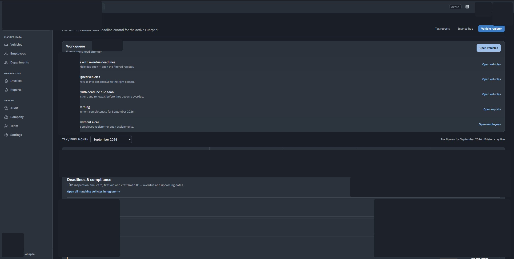
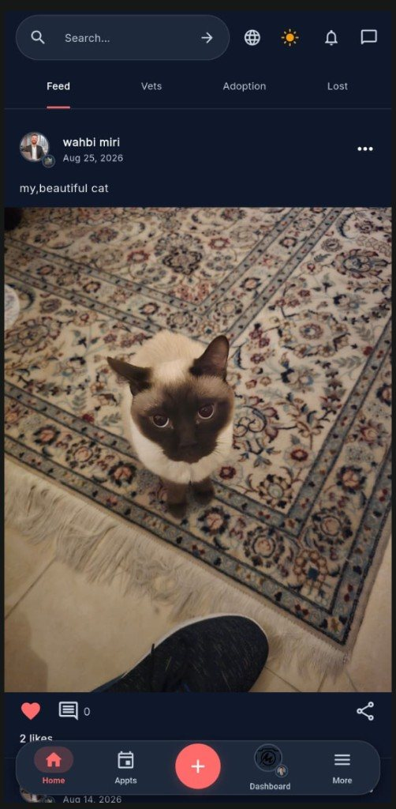
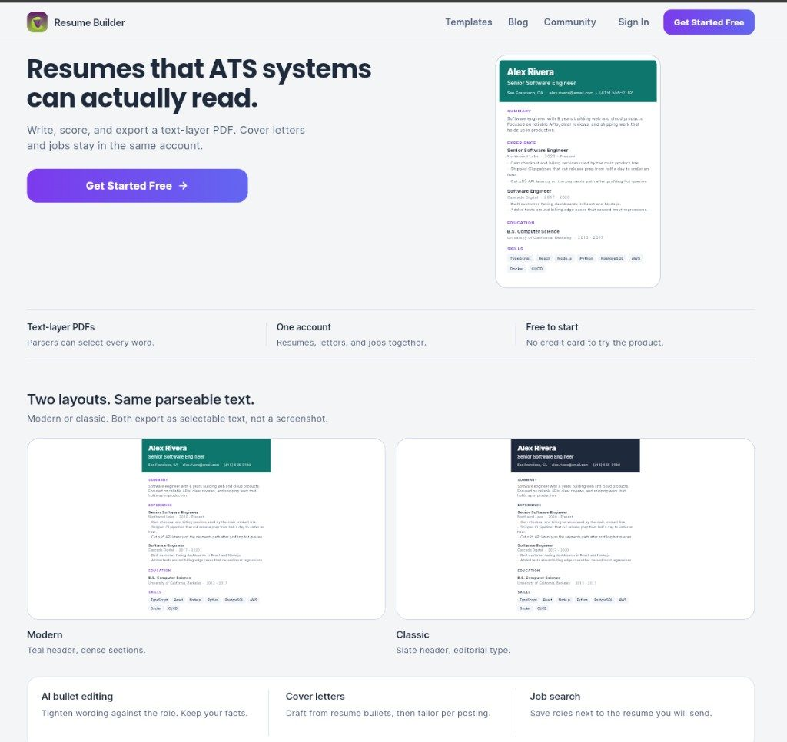

  

<h1 align="center">Wahbi Miri</h1>

  Full-stack product engineer · Qatar · English / Arabic · open to freelance, full-time, and relocation

  
  
  
  

I build the product, put it in production, then try to break it myself. Clients hire me for stores, booking systems, CRMs, and mobile apps — and for AI that already does unpaid office work (invoice parse, PDF extract, resume scoring), not a slide about agents.

[August Weber GmbH](https://www.august-weber.de/) in Munich is already running the fleet CRM I built for them. **PetsMatchy** launches next month. Client repos stay private; screenshots, AI notes, and hire details are on [wahbimiri.github.io](https://wahbimiri.github.io/).

I use **Cursor** to move faster on boilerplate and first drafts. Architecture, the security pass, and the production deploy stay mine.

---

## Selected work

**Fleet CRM — in production at August Weber, Munich**

Next.js desk, FastAPI (invoice parse + DATEV/GoBD Excel), Supabase Auth / RLS, Docker Compose on Elestio. The office uses it now for vehicles, staff, and invoices.

**PetsMatchy — launches next month (October 2026)**

Flutter app for playdates, breeding, chat, vet slots, feed, adoption, lost-and-found. Privacy and terms are already at [petsmatchy.com](https://petsmatchy.com). Not in the stores yet.

**Resume builder — ATS text-layer PDFs**

Write, score, cover letters, job search. Export is selectable text, not a picture of a CV.

**Also live**

- [Eminence CRM demo](https://wahbimiri.github.io/EminencCRM-demo/) — sales / ops CRM, mock data
- [Coffee Impero](https://coffeeimpero.com) — EN/AR store, WhatsApp OTP
- [Gomti Contractor](https://gomticontractor.vercel.app) — bilingual contractor site, Doha
- [Salon Shabab Al Arab](https://salon-shabab-al-arab.pages.dev) — bookings + back office
- [CampGear](https://mystorecamp.com) — camping shop, Tunisia
- [Invoice Generator Pro](https://invoice-generator-pro.pages.dev) — quotes, invoices, stock
- Resume builder — ATS text-layer PDFs, cover letters, job search (Flutter + Edge Functions)

---

## How I work

- Messy brief → live URL the office can open
- Supabase Auth / RLS, FastAPI, Excel when the books need it
- AI only where it pays rent (invoice parse, resume scoring) — keys stay server-side
- Launch pass: auth, access control, injection, uploads, secrets, then patch and re-test
- Only on systems I own or have written permission to test

Full checklist: [wahbimiri.github.io/#security](https://wahbimiri.github.io/#security)

---

## Stack already in production

  

  
  

---

**Hire:** [wahbi@technologist.com](mailto:wahbi@technologist.com) · [+974 7250 1169](tel:+97472501169) · [LinkedIn](https://www.linkedin.com/in/wahbi-miri-56a66714a)
